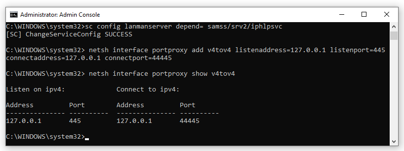
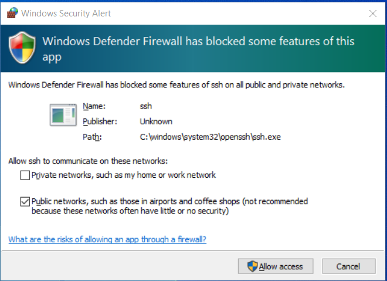
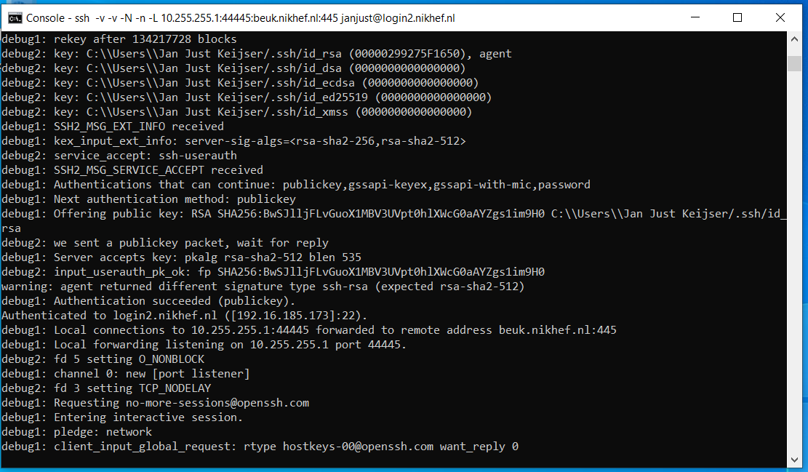
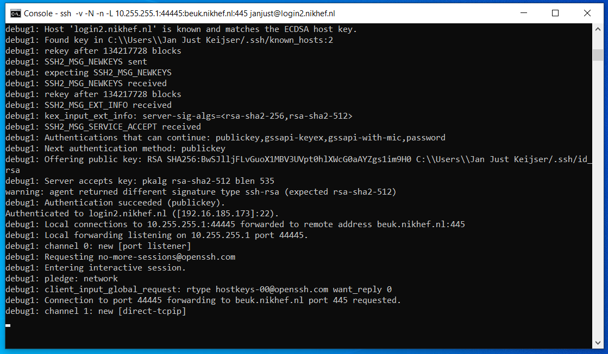

# Prepare Yarra Client Windows Machine to Connect to Yarra Server
First [set up your server](https://github.com/Sydney-Informatics-Hub/yarra/blob/main/YarraServer.md). Then follow this guide to be able to connect to Ronin. It is not as straight forward because you must be on the Sydney Network and you must use SSH-keys to connect to the Ronin remote machines.

Adapted from [this thorough guide](https://github.com/jjkeijser/cifs-over-ssh/blob/9b55de2898900006af2eae9c787fb9b9f7dff93e/Win10/Singlehost.md) with even more configuration options.

# CIFS-over-SSH: Access to a single remote host, no Kerberos
*(tested Win10 1809,1909,20H2,21H1,21H2,22H2 and Win11 22H2 Home&Enterprise)*


## Introduction

To be able to mount a Windows share on a single remote host over SSH we will need 

- Administrator access to the local computer, including the ability to 
  *elevate* privileges. If you don't know what I am talking about then 
  stop reading right here.
- One real or virtual network adapter, bound to the *Client for Microsoft Networks*
  driver.

Normally you should already have such an adapter, as otherwise you
would not be able to mount any Windows shares.


**Note**
With Windows 10 & 11, it is no longer required to add a `Loopback` adapter to if you need
access a single remote host. That is the main difference between this tutorial
and the [Multi-host](https://github.com/jjkeijser/cifs-over-ssh/blob/9b55de2898900006af2eae9c787fb9b9f7dff93e/Win10/Multihost.md) version.


This part of the tutorial is split into the following steps:

1.  Starting with Windows 10 update 1903, the Windows 10 feature "SMB 1.0" must be 
   <a href="#disabling-the-smb-10-windows-feature">turned off</a>.
2. Furthermore, a few Windows system services need to be
   <a href="#tweaking-the-lanmanserver-service">tweaked</a>.
3. Next, reboot Windows to <a href="#reboot-and-verify">verify</a> that we've been able to 
   grab port 445 and to see if the `lanmanserver` service is up and running.
4. Finally, we launch a special OpenSSH session and 
   <a href="#mapping-a-network-drive">mount</a> our remote share.

5. For those wishing to <a href="#controlz-undo-undo">undo</a> the above steps follow the 
   instructions at the bottom of this page.


## Disabling the 'SMB 1.0' Windows feature

**NOTE**: for a lot of users this does not seem to apply. I have left this step in the tutorial,
as it is good security practice anyways.


Starting with Windows 10 update 1903 we need to disable the Windows feature `SMB 1.0`:

- Go to the **Control Panel->Programs->Programs and Features** and select
  **Turn Windows features on or off**
- A list of features pops up:

  

  Scroll down and deselect the feature **SMB 1.0/CIFS File Sharing support**
- Now close this control panel item. 


## Tweaking the 'LanmanServer' service

First, we need to tweak a Windows system service to overcome the thing that 
Microsoft broke. The root cause of the problem is that we need to access the 
file share using TCP port **445**. However, when Windows boots, this port is 
grabbed by the system `lanmanserver` service for all interfaces.


If we can insert a `portproxy` rule to grab port 445 for the loopback
interface **before** the `lanmanserver` service starts, we can circumvent this.
Be aware that `portproxy` rules are executed by the `iphlpsvc` service.


By adding a dependency to the `lanmanserver` service we ensure that the 
`iphlpsvc` service is **always** launched before the `lanmanserver`
service. This section explains how to do this:

- Start a Command Prompt console window with elevated (Administrator) privileges.
- Get the list of service dependencies by typing:

```
  sc qc lanmanserver
```
  You should see output similar to this:

```
[SC] QueryServiceConfig SUCCESS

SERVICE_NAME: lanmanserver
        TYPE               : 20  WIN32_SHARE_PROCESS 
        START_TYPE         : 2   AUTO_START
        ERROR_CONTROL      : 1   NORMAL
        BINARY_PATH_NAME   : C:\WINDOWS\system32\svchost.exe -k netsvcs -p
        LOAD_ORDER_GROUP   : 
        TAG                : 0
        DISPLAY_NAME       : Server
        DEPENDENCIES       : SamSS
                           : Srv2
        SERVICE_START_NAME : LocalSystem
```

- Note down the names of the services on which the `Server` service
(also known as `lanmanserver`) depends. In this case, these services
are `samss` and `srv2` (the service names are case independent).

- Change the list of services on which the `lanmanserver` services depends
by adding the `iphlpsvc` service to the list of required services found in the
previous step:

```
  sc config lanmanserver depend= samss/srv2/iphlpsvc
```

**NOTES:**
  - The space after the `"depend= "` is required!
  - Dependencies are separated using slashes ("/").


- Next we add a `portproxy` rule to reroute TCP port 445 to a port of
  our choosing. For this tutorial, I choose **44445**:
```
  netsh interface portproxy add v4tov4 listenaddress=127.0.0.1 listenport=445 connectaddress=127.0.0.1 connectport=44445
```

  **NOTE**:
  The `connectaddress`  must be identical to the `listenaddress`


If all went well you should see something like



The `portproxy` rule is persistent, so there should be no need to repeat
this step after a reboot.


## Reboot and verify

Of course, now that we have made modifications to the 'Required Services' dependency of the
'LanmanServer' service we have to reboot Windows before proceeding.

- Reboot Windows.
- Verify that the `portproxy` was applied successfully by checking the open ports 
  on the system. Type in a command console
```
  netstat -an | find ":445"
```
  You should see something like:
```
C:\WINDOWS\system32>netstat -an | find ":445"
  TCP    0.0.0.0:445            0.0.0.0:0              LISTENING
  TCP    127.0.0.1:445          0.0.0.0:0              LISTENING
  TCP    [::]:445               [::]:0                 LISTENING
```

  If you see **only** '`0.0.0.0:445`' instead then the 'portproxy' rule was 
  not applied correctly.  Verify that the right 'portproxy' rule was used
```
   netsh interface portproxy show v4tov4
```
   and verify that the `IpHlpSvc` service is running at Windows startup using
```
  sc query iphlpsvc
```
  Another reason for the 'port grabbing' to fail could be the `LanmanWorkstation` service 
  running at Windows startup. If so, try giving it the same treatment as `LanmanServer`.
  However, on the Windows 10 & 11 installations I tested this service was running at system startup 
  without causing any problems.
- After Windows comes up and you have logged in, check the status of the 'lanmanserver' service. Open
  a command console (no privilege elevation is required) and type
```
  sc query lanmanserver
```
  The 'LanmanServer' service should be in the state **Running**. 
  If it is not, then follow 
  [these steps](https://jjkeijser.github.io/cifs-over-ssh/WinAddTask.html)
  to create a task using the Task Schedule to start it at system startup.

If the port is not grabbed correctly (i.e. no `127.0.0.1:445` in the `netstat` output)
then try the 
[Old driver tweak](https://jjkeijser.github.io/cifs-over-ssh/Win10/Win10ConfigureServices.html)
instructions to see if that works better for you.


## Putting it all together

Now that we have configured both our loopback adapter we can put it all together by launching 
a special OpenSSH connection and mounting the shares from the remote server `fs1.example.org`
as a Windows share:

- Launch an OpenSSH session with some special port-forwarding rules and login on 
  `yarraserve.sydneyuni.cloud` as normal. Open a Command console or terminal and type:
```
  ssh -v -N -n -i C:\Users\youname\ronin-ssh-key.pem -L 127.0.0.1:44445:yarraserve.sydneyuni.cloud:445 ubuntu@yarraserve.sydneyuni.cloud
```
  Yes, there are lots of colons in that `-L` option but you need them all.

- Replace `C:\Users\youname\ronin-ssh-key.pem` with the location of your SSH key for connecting to Ronin.
- Replace `yarraserve.sydneyuni.cloud` with the name of your machine. `ubuntu` is the default username to connect with.
- The first time you start the command with the special
  port forwarding rules, you will be (probably) be prompted by the Windows
  Defender Firewall that it has blocked some features:

  

  Allow access to at least **Public** networks by ticking the checkbox,
  then click on **Allow access** as otherwise the port-forwarding will not work.
- Make sure port-forwarding is working properly by checking the (verbose) log:

  

  Make sure the line
```
  debug1: Local connections to 127.0.0.1:44445 forwarded to remote address yarraserve.sydneyuni.cloud:445
```
    is present before continuing.

- Go to **Start->Run** and type `\\127.0.0.1\`
- In the Console window you should now see a line 
```
  debug1: Connection to port 44445 forwarding to fs.example.org:445 requested.
``` 
  as in the following screenshot:

  

 
  **Note** 
  If you carefully inspect the above screenshot then you will notice that I am using
  the (built-in) OpenSSH Authentication Agent in combination with an SSH public/private keypair to
  avoid having to type in my password every time.


# Connecting to Yarra

The Yarra client will connect to the network share and mount it as a drive. 

Grab the SCA.exe client from the [Yarra Download page](https://yarra-framework.org/clients/)

Upon first launch you can configure the Client Network parameters as follows (replace `yarrapassword` with the password you used in the server setup).

- **Server Path:** `Y:`
- **Connect Cmd:** `net use Y: \\127.0.0.1\YarraServer yarrapassword /USER:yarra /yes`
- **Disconnect Cmd:** `net use y: /delete /yes`

Remember you will always need to first establish the connection ssh tunnel with the previous command:
```
 ssh -N -n -i C:\Users\youname\ronin-ssh-key.pem -L 127.0.0.1:44445:yarraserve.sydneyuni.cloud:445 ubuntu@yarraserve.sydneyuni.cloud
```

# Control+Z! Undo! Undo!

For those wishing to undo the CIFS-over-SSH trick follow these steps:

- Start a console window with elevated (Administrator) privileges.
- Restore the dependencies of the `lanmanserver` service by typing
```
  sc config lanmanserver depend= samss/srv2
```
**NOTES**
  - the list of required services may be slightly different on your system. 
    Use the PowerShell command from
    <a href="#tweaking-the-lanmanserver-service">this section</a>
    to obtain a list.
  - the space after the `depend= ` !
- Remove the `portproxy` rule by typing
```
  netsh interface portproxy delete v4tov4 listenaddress=127.0.0.1 listenport=445
```
- Remove the firewall rule to allow SSH to do portforwarding from 127.0.0.1:
  - Go to the Windows Control Panel</li>
  - Select **System and Security**, then **Windows Defender Firewall**</li>
  - Select **Allowed apps**, and scroll down in the list to 
    **SSH Telnet and Rlogin client** and deselect the permissions

    

    Then press **OK**
- Start a `Device Manager` by typing
```
  devmgmt.msc
```

- Expand the 'Network Adapters', right-click on **Loopback adapter** and select 
  **Uninstall**.
- If necessary, use the 'Task Scheduler' from the 'Administrative Tasks' menu to delete the
  task 'Start LanmanServer driver'.
